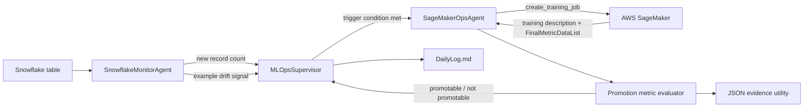
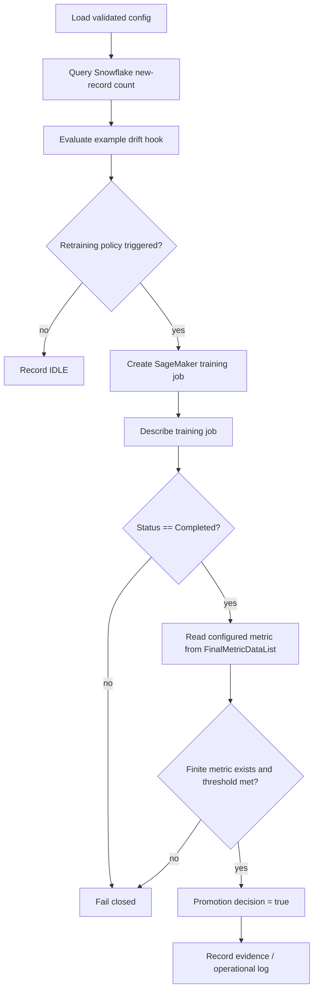

# AWS SageMaker + Snowflake MLOps Pipeline

[](https://github.com/CoreyLeath-code/AWS-SageMaker-Snowflake-ML-Pipeline/actions/workflows/ci.yml)
[](https://github.com/CoreyLeath-code/AWS-SageMaker-Snowflake-ML-Pipeline/actions/workflows/sagemaker-pipeline-hygiene.yml)
[](https://github.com/CoreyLeath-code/AWS-SageMaker-Snowflake-ML-Pipeline/actions/workflows/release.yml)
[](LICENSE)

A portfolio-scale MLOps orchestration prototype that monitors Snowflake metadata, applies a configurable retraining trigger, starts an AWS SageMaker training job, and evaluates a fail-closed promotion metric. The repository is designed to make orchestration boundaries, evidence handling, and cloud-risk assumptions inspectable rather than to claim production authorization.

## Engineering scope

Implemented:

- Snowflake row-count monitoring against a configured table.
- A deterministic retraining trigger based on new-record volume and an example drift hook.
- SageMaker training-job creation through `boto3`.
- Fail-closed model-promotion evaluation using a configured metric name and threshold.
- Reproducible JSON evidence recording with payload hashing, source/runtime metadata, threshold, value, and promotion decision.
- Offline CI/tests that do not require live AWS or Snowflake access.
- Container packaging plus semantic-tag release automation.

Not claimed:

- production data-governance approval;
- complete drift detection;
- end-to-end cloud reliability or cost evidence;
- model generalization, fairness, robustness, or safety evidence;
- automated model deployment after training.

## Architecture flow



## System design flow



The critical trust boundary is promotion: a completed training job is insufficient by itself. The code requires the configured metric to be present, finite, and threshold-compliant before returning a promotable result.

## Quickstart

Prerequisite: Python 3.11.

```bash
git clone https://github.com/CoreyLeath-code/AWS-SageMaker-Snowflake-ML-Pipeline.git
cd AWS-SageMaker-Snowflake-ML-Pipeline
python -m venv .venv
source .venv/bin/activate  # Windows: .venv\Scripts\activate
python -m pip install --upgrade pip
python -m pip install -r requirements.txt
python -m compileall -q agents scripts tests
pytest -q
```

The offline test path should not require AWS credentials, Snowflake credentials, or internet-facing infrastructure.

## Reproducibility contract

Use the checked-in configuration plus an explicit metrics payload to reproduce a promotion decision:

```bash
python -m scripts.record_metric_evidence \
  --config config/agent_config.yaml \
  --metrics-json path/to/final-metrics.json \
  --job-name training-job-name \
  --output evidence/promotion.json
```

The evidence record is designed to preserve the metric payload SHA-256, source commit when available, Python/platform metadata, job name, metric name/value, threshold, and promotion decision. Reproducing a decision therefore requires the same config and metrics payload, not merely the same README.

## Research-style metrics and benchmark status

This repository intentionally does **not** publish invented training-performance or model-quality numbers. Current evidence is focused on deterministic promotion logic and provenance.

| Evidence dimension | Current status | Interpretation |
|---|---|---|
| Promotion metric | Measured from supplied SageMaker metric payload | Used only for configured promotion logic |
| Metric payload integrity | SHA-256 recorded | Detects evidence-payload changes |
| Source provenance | Commit recorded when available | Ties decision evidence to code revision |
| Runtime metadata | Python/platform recorded | Supports reproducibility diagnostics |
| Offline correctness | Pytest/CI | Validates config, feature/data utilities, inference helpers, and promotion logic |
| Drift quality | Not benchmarked | Current drift hook is an example, not a validated detector |
| Training latency / cost | Not published | Requires controlled cloud experiments |
| ROC-AUC / F1 / calibration | Not published | Requires approved dataset and held-out evaluation |
| Fairness / subgroup behavior | Not published | Requires domain-specific study |

### Recommended research protocol for future cloud benchmarks

Any future benchmark should record commit SHA, AWS region, SageMaker instance type/count, container image digest, dataset version/hash, random seeds, train/validation split, sample size, warm-up policy, repeated-run count, training duration, cost estimate, peak resource usage, metric distribution, and confidence intervals where appropriate. Cloud latency and cost should not be compared across materially different instance classes as if they were equivalent.

## Configuration and trust boundaries

Non-secret configuration belongs in `config/agent_config.yaml`. Credentials must remain environment-provided or come from an approved secret manager. Running the live supervisor requires reviewed AWS IAM permissions, Snowflake identity, network access, and data-governance approval.

The current Snowflake drift method returns a fixed example result rather than executing a statistically validated PSI procedure. Treat it as a scaffold, not drift evidence.

## Validation commands

```bash
python -m compileall -q agents scripts tests
pytest -q
python -m scripts.record_metric_evidence --help
```

For container validation:

```bash
docker build -t aws-sagemaker-snowflake-ml-pipeline .
```

## Release contract

Version tags matching `v*.*.*` publish a GitHub Release containing a source archive and SHA-256 checksum, and publish a GHCR container image tagged with the semantic version and `latest`.

Example release trigger:

```bash
git tag -a v1.0.0 -m "AWS SageMaker Snowflake ML Pipeline v1.0.0"
git push origin v1.0.0
```

Engineering review

The strongest part of the current design is the fail-closed promotion boundary. The main gaps before a production-readiness claim are stronger Snowflake query safety and failure semantics, a real validated drift detector, explicit SageMaker wait/poll/timeout behavior, immutable training-data provenance, held-out model evaluation, deployment approval separation, IAM least-privilege evidence, end-to-end observability, and release provenance beyond checksums. See [L6_AUDIT.md](L6_AUDIT.md).

## Q&A

**Does this automatically deploy a trained model?**  
No. It creates a SageMaker training job and evaluates promotion evidence. A promotable result is not equivalent to deployment approval or a deployed endpoint.

**Is drift detection implemented?**  
Only as an example hook. The current method returns a fixed false value and does not constitute statistical drift evidence.

**Does CI call AWS or Snowflake?**  
No. The repository is structured so baseline tests can run offline.

**Why is the promotion logic useful?**  
It demonstrates a control boundary: job completion alone does not imply success. The expected metric must exist, be finite, and meet the configured threshold.

**What would make this production-grade?**  
Least-privilege cloud roles, governed secrets, validated dataset/model lineage, real drift/evaluation protocols, bounded polling and retries, idempotent orchestration, structured telemetry, deployment approval separation, staging/rollback evidence, and stronger artifact provenance.

## License

MIT.
