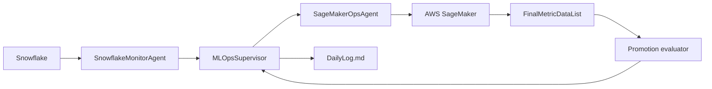
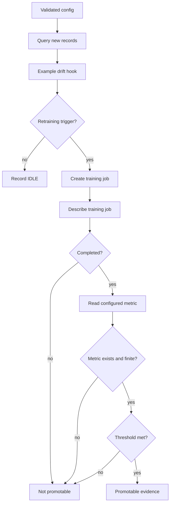

# Architecture

## Runtime architecture

## Promotion control flow

## Boundaries

- Snowflake credentials are environment-provided.
- Snowflake row-count monitoring is live-capable; the drift method is currently an example stub returning false.
- SageMaker training submission is implemented through `boto3`.
- Job lifecycle polling/waiting is not yet a complete state machine.
- Promotion is evidence-gated but is not equivalent to deployment approval.
- CI validation is intentionally offline and should not be represented as a live-cloud integration test.
